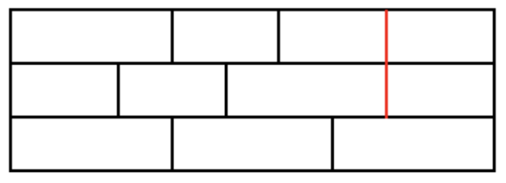

<script
  src="https://cdn.mathjax.org/mathjax/latest/MathJax.js?config=TeX-AMS-MML_HTMLorMML"
  type="text/javascript">
</script>
<head>
    <meta charset="UTF-8">
    <!-- MathJax Configuration -->
    <script type="text/x-mathjax-config">
        MathJax.Hub.Config({
            extensions: ["tex2jax.js"],
            jax: ["input/TeX", "output/HTML-CSS"],
            tex2jax: {
                inlineMath: [["$", "$"], ["\\(", "\\)"]],
                processEscapes: true
            },
            "HTML-CSS": { scale: 100 }
        });
    </script>
</head>

# Floorboard Problem

## Problem description:
Consider building a floor out of $(2 \times 1)$ and $(3 \times 1)$ floorboards (length $\times$ width dimesions). For aesthetic reasons, the end of the boards should not line up. For example, the following $(9 \times 3)$ floor is not acceptable due to the alignment shown in red:


There are eight ways of forming an acceptable $(9 \times 3)$ floor, expressed as $F(9,3) = 8$.

Calculate $F(32,10)$

## Solution
The solution to this problem involves an algorithm that uses simulation along with dynamic programming. Given that we are trying to find all acceptable ways of designing a floor of a specific height and width with an acceptbale pattern, the first step is to find all possible rows that can be made of a given width. 

<pre>
```python
# This is a Python code block
def hello_world():
    print("Hello, World!")

hello_world()
```
</pre>

